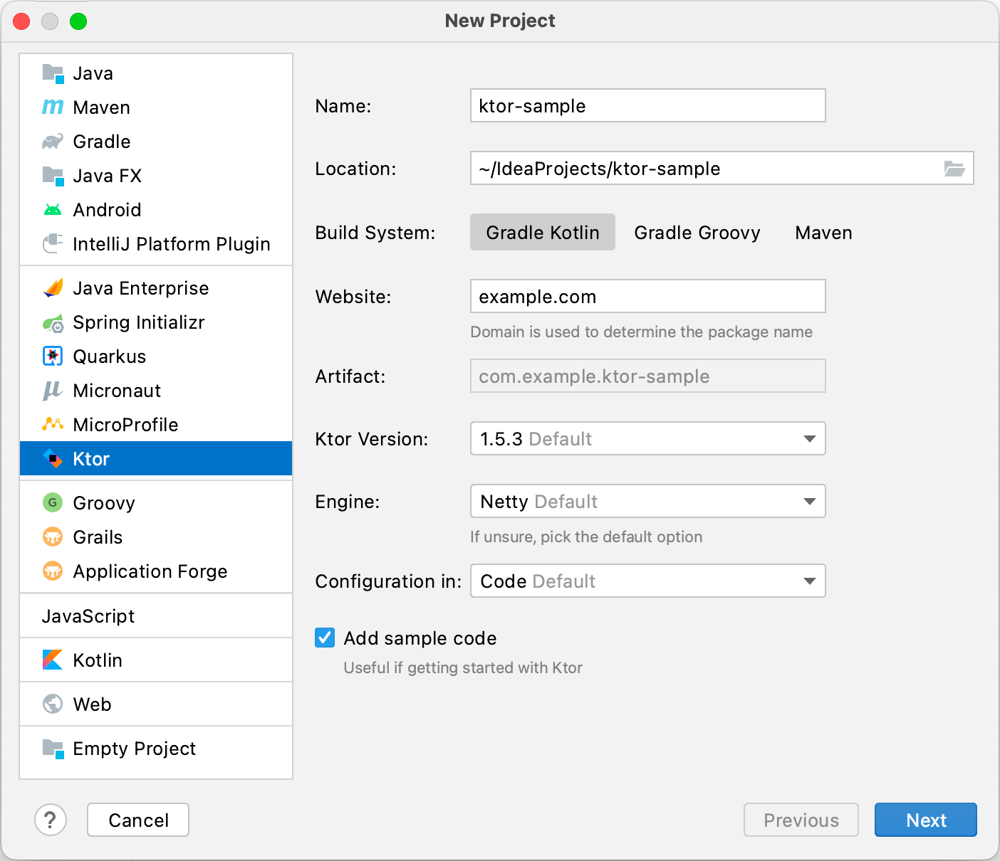

### Goal
Bored with the constant use of spring in commercial projects, \
I decided to investigate the use of a basin with an alternative solution.

Requirements for alternative:
* Easy to implement endpoints & test HTTP layer
* Possibility of working with WebSockets  
* Easy to implement JWT authorization
* Alternative for Spring repositories with easy saving & pagination

### Alternative stack
* Ktor for HTTP
* KMongo for working with database

### Start up
Instruction how to easily start with Ktor: [Link](https://ktor.io/docs/intellij-idea.html#install_plugin)

1) Install Ktor plugin: [Link](https://plugins.jetbrains.com/plugin/16008-ktor?_ga=2.119157257.1475561129.1641494389-2002089144.1641494389&_gl=1*10ouy88*_ga*MjAwMjA4OTE0NC4xNjQxNDk0Mzg5*_ga_VCMCSM1ZZ7*MTY0MTU3MDgyMS4yLjEuMTY0MTU3MzEwOC4w)

2) Create new project in IntelliJ
   
   
