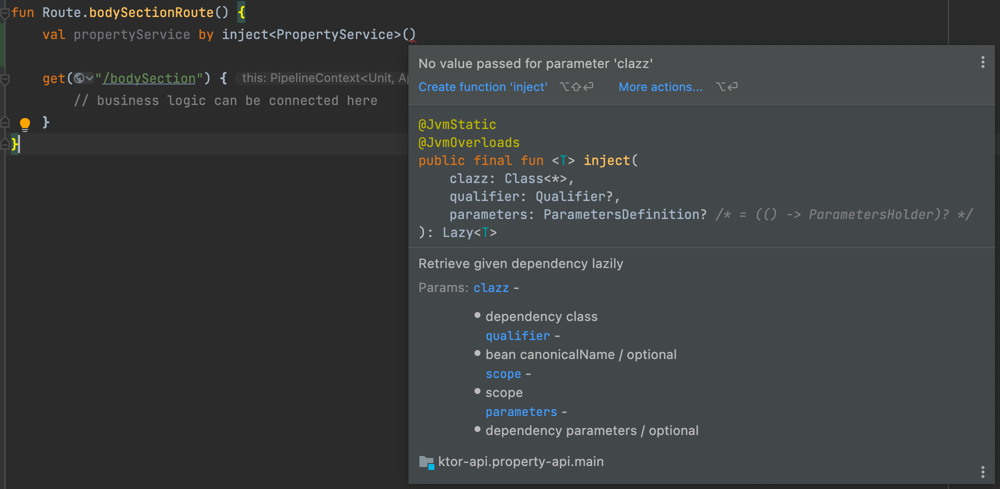

### Goal
Bored with the constant use of spring in commercial projects, \
I decided to investigate the use of a basin with an alternative solution.

Requirements for alternative:

* Easy to implement endpoints & test HTTP layer
* Way to inject dependencies into classes
* Possibility of working with WebSockets
* Easy to implement JWT authorization
* Alternative for Spring repositories with easy saving & pagination

### Alternative stack
* Ktor for HTTP
* Koin for DI
* KMongo for working with database

### Start up
Instruction how to easily start with Ktor: [Link](https://ktor.io/docs/intellij-idea.html#install_plugin)

1) Install Ktor
   plugin: [Link](https://plugins.jetbrains.com/plugin/16008-ktor?_ga=2.119157257.1475561129.1641494389-2002089144.1641494389&_gl=1*10ouy88*_ga*MjAwMjA4OTE0NC4xNjQxNDk0Mzg5*_ga_VCMCSM1ZZ7*MTY0MTU3MDgyMS4yLjEuMTY0MTU3MzEwOC4w)

2) Create new project in IntelliJ
   

You can also manipulate existing gradle (or maven) configuration
https://ktor.io/docs/gradle.html#create-new-gradle-project

### HTTP Layer
Routing is organized in a tree with a recursive matching system that is capable of handling quite complex rules for request processing. 
The Tree is built with nodes that contain selector and optional handler. 
Selectors are used to pick a route based on request.
Source: https://ktor.io/docs/resolution-algorithms.html

### Dependency Injection
Dependency injection is handled differently in functional languages, but due to Spring habits we don't want to
experience shock therapy. Therefore, we will use the Koin library to build something "Spring-ish".

### Koin
When I tried to follow [basic Koin instruction](https://insert-koin.io/docs/quickstart/ktor) I ran into a problem while implementing quickstart section.
I couldn't use `inject` as in documentation:
https://stackoverflow.com/questions/70461172/ktor-with-koin-di-cant-inject-missing-clazz

